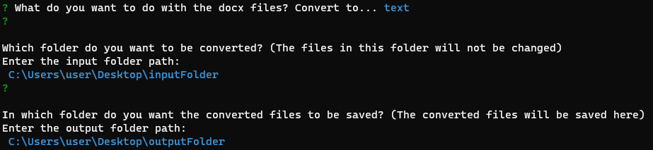
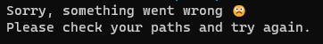

# Docxtract
#### Extract docx files into text or html, right from the terminal

## Table of Contents

- [Requirements](#requirements)
- [Usage](#usage)
- [Technologies Used](#technologies-used)
- [Authors](#author)

## Requirements:
Node.js

## Usage

1. From a terminal, type:
    ```shell
    npx docxtract
    ```

2. Use the arrow keys to choose whether you want to convert the docx files to text or html

3. Enter the path of the folder which contain the files you want to convert

4. Enter the path of the folder where you want to save the converted files

   

5. Upon success, the text or html files will be saved to the output folder. The original docx files in the input folder will not be changed. </br>Upon error, such as with the paths entered being invalid paths, the program will exit with an error message:

    


  Please note this code has only been tested on Windows.

## Technologies Used

- Node
- JavaScript

## Author

- Raphael

Feel free to report issues and provide feedback!
